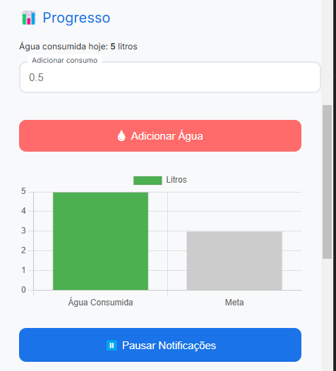

# Gole a Gole 🚰

**Gole a Gole** é uma extensão para o Google Chrome que ajuda você a se manter hidratado ao longo do dia. Com lembretes personalizáveis e um sistema de acompanhamento de consumo de água, você nunca mais vai se esquecer de beber água!

---

## Funcionalidades ✨

- **Defina sua meta diária de água**: Escolha quantos litros de água você deseja beber por dia.
- **Lembretes personalizáveis**: Receba notificações no intervalo de tempo que você escolher.
- **Acompanhe seu progresso**: Veja um gráfico que mostra quanto você já bebeu e quanto falta para atingir sua meta.
- **Pausar notificações**: Temporariamente pare de receber lembretes quando necessário.
- **Mensagens motivacionais**: Receba uma mensagem de parabéns quando atingir sua meta diária.
- **Copiar chave PIX**: Copie a chave PIX para fazer uma doação e apoiar o projeto.

---

## Capturas de Tela 📸

*Interface principal da extensão.*

*Gráfico de progresso e notificações.*

---

## Como Usar 🛠️

1. **Defina sua meta diária**:
   - Na seção "Configurações", insira a quantidade de água que deseja beber (em litros).
   - Defina o intervalo de tempo para receber lembretes (em minutos).

2. **Adicione água consumida**:
   - Clique em "Adicionar Água" e insira a quantidade de água que você bebeu.

3. **Acompanhe seu progresso**:
   - Veja o gráfico que mostra seu consumo diário e quanto falta para atingir a meta.

4. **Pausar notificações**:
   - Use o botão "⏸️ Pausar Notificações" para parar temporariamente os lembretes.

5. **Copiar chave PIX**:
   - Clique no botão "Copiar" ao lado da chave PIX para fazer uma doação e apoiar o projeto.

---

## Instalação 📥

### Passo a Passo

1. **Baixe o código**:
   - Clone este repositório ou faça o download do arquivo ZIP.

2. **Acesse o Chrome**:
   - Abra o Google Chrome e vá para `chrome://extensions/`.

3. **Ative o Modo de Desenvolvedor**:
   - No canto superior direito, ative o "Modo de Desenvolvedor".

4. **Carregue a extensão**:
   - Clique em "Carregar sem compactação" e selecione a pasta do projeto.

5. **Pronto!**:
   - A extensão estará disponível na barra de ferramentas do Chrome.

---

## Tecnologias Utilizadas 💻

- **HTML5**: Estrutura da interface.
- **CSS3**: Estilização e design responsivo.
- **JavaScript**: Lógica e interatividade.
- **Chart.js**: Gráficos para acompanhamento de progresso.
- **Chrome Extensions API**: Integração com o navegador Chrome.

---

## Contribuição 🤝

Contribuições são bem-vindas! Se você quiser melhorar o projeto, siga os passos abaixo:

1. Faça um **fork** do repositório.
2. Crie uma nova branch com sua feature: `git checkout -b minha-feature`.
3. Faça commit das suas alterações: `git commit -m 'Adicionando nova feature'`.
4. Envie para o repositório remoto: `git push origin minha-feature`.
5. Abra um **Pull Request** e descreva suas alterações.

---

## Licença 📜

Este projeto está licenciado sob a **MIT License**. Veja o arquivo [LICENSE](LICENSE) para mais detalhes.

---

## Contato 📞

Se tiver dúvidas, sugestões ou quiser entrar em contato, você pode me encontrar aqui:

- **GitHub**: [Ageursilva](https://github.com/Ageursilva)
- **Email**: ageu13silva@gmail.com
- **Chave PIX**: `8ed12323-9c5b-4f81-9f74-18c3108f57a4`

---

**Mantenha-se hidratado e aproveite o Gole a Gole!** 🚰💧